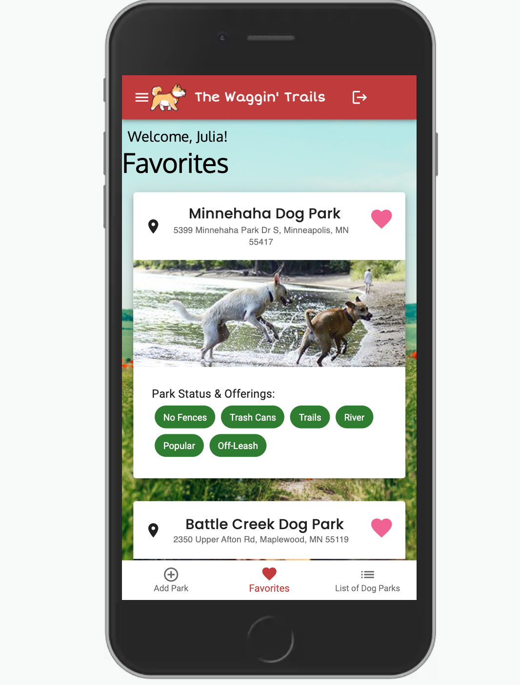

    
    
# The Waggin' Trails

## Table of Contents

- [Description](#description)
- [Screenshots](#screenshots)
- [Built With](#built-with)
- [Getting Started](#getting-started)
  - [Prerequisites](#prerequisites)
  - [Installation](#installation)
- [License](#license)
- [Acknowledgements](#acknowledgements)
- [Contacts](#contacts)

## Description

Full CRUD app created for dog lovers who want to know up-to-date conditions on local dog parks, find dog parks they didn’t know about, and avoid those uncomfortable visits that end up in a muddy car.

Users can add new dog parks, associate them with tags such as ‘pond’, ‘mud’ or ‘small dog area’ that can be easily seen, review parks, and have their favorites on a home page for ease and accessibility.

Visit the app here: https://waggintrails.herokuapp.com/

## Screenshots

## Built With

## Getting Started

### Prerequisites

Make sure to have Postgres and Node.js.

### Installation

1. Clone the repo

2. Set up a database called The_Waggin_Trails in Postgres. Using the database.sql file, create all the tables, add the Alter Tables commands, and then add all the data. 

3. Run 'npm install' as a terminal command.

4.  Split the terminal and run 'npm run server' in terminal A and 'npm run client' in terminal B. You can find the app at http://localhost:3000/.

5. Have fun playing around!

## License

<a href="https://choosealicense.com/licenses/mit/">MIT License</a>

## Acknowledgements

A special thanks to the team at Prime Digital Academy for the support in building a project like this. And of course, my fours dogs for being the inspiration of this app! 

## Contacts

  
